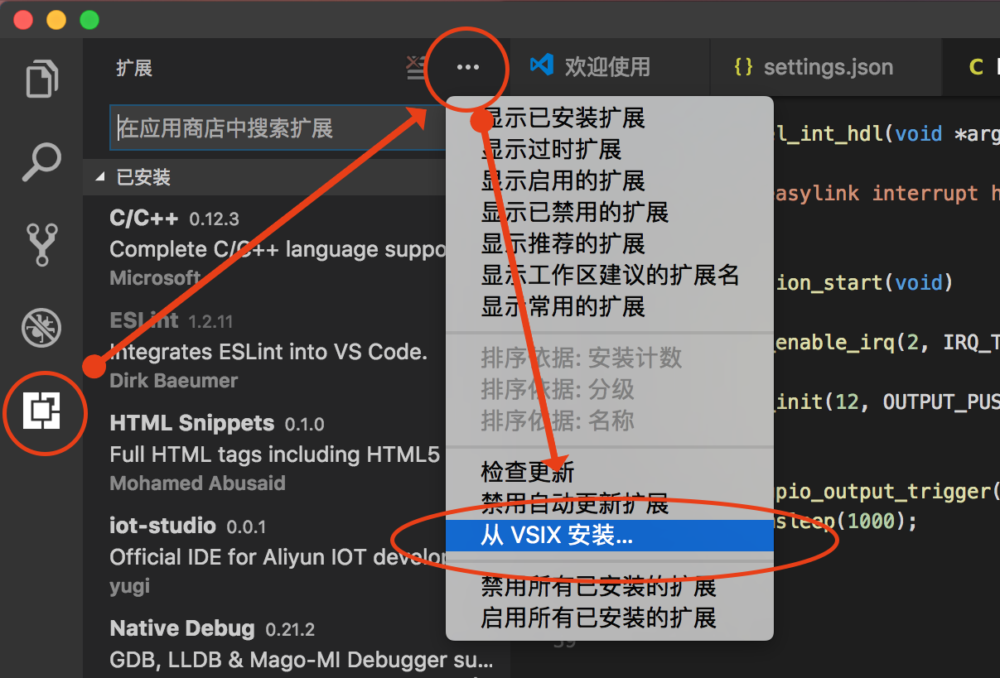
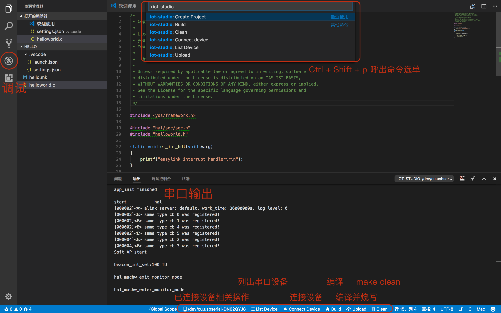

# 下载地址

   * 下载并安装[VSCode](https://code.visualstudio.com/)
   * 下载[IoT Studio插件](http://gitlab.alibaba-inc.com/yunos-studio/daily-release/raw/iot-v0.0.1/iot-studio-0.0.1.vsix)

# 安装步骤

    首先安装VSCode, 然后打开VSCode, 如图所示选择Install from VSIX / 从VSIX安装，并选择iot-studio-0.0.1.vsix，稍后根据提示重载VSCode即可。

# 功能介绍
 
 
 
## 新建项目

    新建项目功能主要面向IoT应用的开发者，开发者在选择板子和模板类型后，即可生成出一个样例应用的模板。
    
## 设备管理

    设备管理功能包括列出当前电脑插上的串口设备，连接串口设备，显示串口输出，向串口发送数据等。初次需要选择串口号及波特率等信息。
    
## 编译功能

    编译功能包括clean和build.build完成后会显示图形化的Image Footprint及与上一次编译的Image Footprint的对比。如果需要配置编译的目标，可以编辑.vscode/settings.json配置文件中的iotStudio.name及iotStudio.hardward.board参数。
    
## 烧录功能

    烧录功能既可以在点击状态栏的设备后选择Burn并指定一个镜像路径烧录，也可以选择upload一键完成编译及烧录的功能。烧录前需要将设备手动切换到Bootloader模式下。
    
## 语法提示及调试功能

    目前IoT Studio通过cpptools插件支持c的语法提示，通过vscode本身的调试器支持gdb调试功能。

